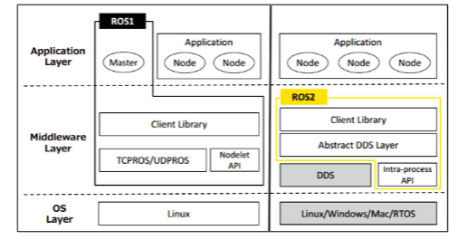

## 基础概述

Linux 版本与 ROS2 版本的选择也是有对应关系的，两者对应的版本如下
| ROS2 版本 | Ubuntu 版本 |
| :---: | :---: |
| Foxy | Ubuntu20.04 |
| Galactic | Ubuntu20.04 |
| Humble | Ubuntu22.04 |

### 特点

- 分布式架构        允许在多个计算机上运行不同的节点

- 支持多语言        支持多种编程语言，包括 C++、Python、Java 等

- 强化的通信机制         Data Distribution S
ervice（DDS）。DDS 是一种高性能、实时的消息传递协议，可以在 ROS 2 系统中实现可靠的数据通信

- 系统级别的工具统级别的工具，用于管理和监控 ROS 2 系
统。这些工具包括包管理工具（如 Colcon）、日志记录工具（如 Rosout）和诊断工具（如Rqt）等

- 实时性能

- 易于扩展和集成

### 和ros1的对比

1. ros1 目前仅支持linux。ros2可以在ubuntu、windows甚至嵌入式开发板
2. 语言
   1. ROS1 的核心是 C++03，而 ROS2 广泛使用 C++11.
   2. ROS1 的 Python 使用版本是 Python2，而 ROS2 使用的 Python 版本至少是 3.5 以上，Humble 使用的 Python 版本是 3.6
3. ROS1 启动前需要开启 roscore，这个 master 掌握所有的节点之间的通讯

    而 ROS2则没有，只有一个抽象的中间件接口，通过该接口进行传输数据。
    目前，此接口的所有实现都基于 DDS 标准。这使得 ROS2 能够提供各种优质的 Qos 服务策略，从而改善不同网络的通信
