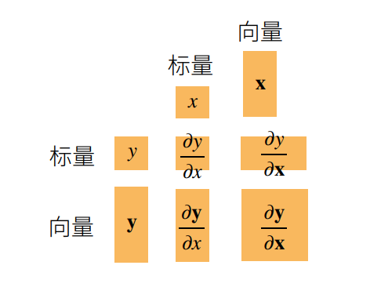
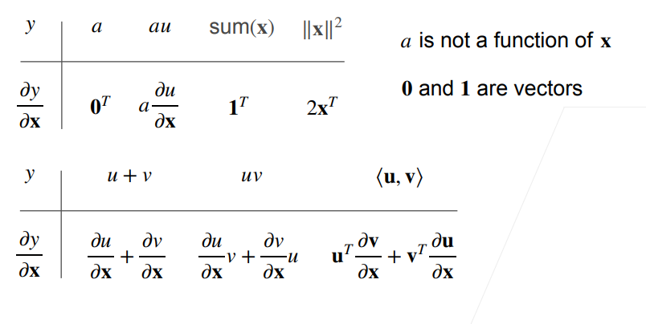
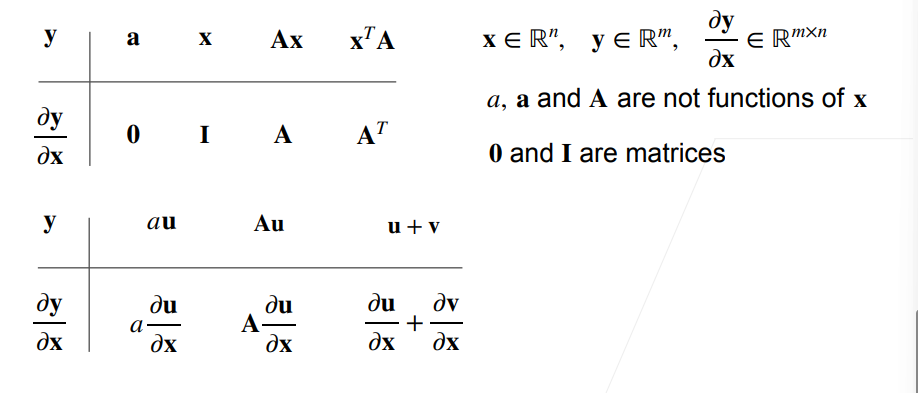
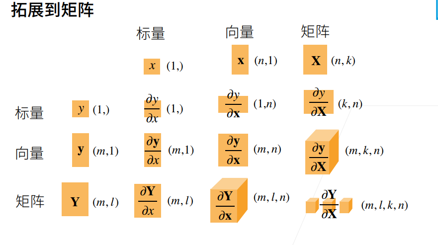

### 梯度
 
 也就是把导数拓展到向量，计算标量和向量、向量和向量、矩阵和。。。

与之对应的也就是

注：初始向量都设为列向量

|         |         |
|-----------|--------|
|   标量/标量=标量    |  标量/向量=向量的转置 |
|   向量/标量=向量    |   向量/向量=矩阵     |

dy/**dx**是行向量，**dy**/dx是列向量，被称为分子布局符号， 反过来也就是分母布局符号

